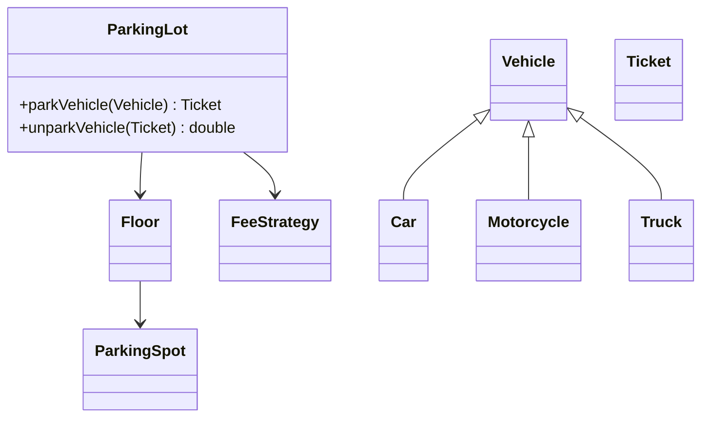
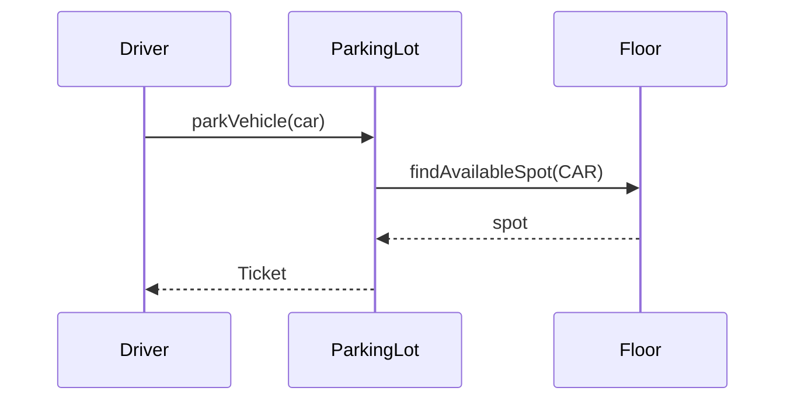

# Problem 01: Parking Lot

## Problem Statement

Design a multi-floor parking lot that supports different vehicle types, assigns spots dynamically, and calculates parking fees on exit.

## Functional Requirements

1. Support vehicle types: motorcycle, car, truck
2. Assign nearest available spot on entry; reject if full
3. Calculate fee on exit based on duration and vehicle type
4. Track occupied vs available spots per floor

## Out of Scope

- Payment gateway integration
- License plate OCR / cameras
- Multi-location parking networks

## Class Diagram

## Sequence Diagram (Entry Flow)

## API Surface

| Method | Description |
|--------|-------------|
| `parkVehicle(Vehicle)` | Assign spot, return ticket |
| `unparkVehicle(Ticket)` | Free spot, return fee |
| `getAvailableSpots(VehicleType)` | Count free spots |

## Design Patterns

- **Strategy**: `FeeStrategy` for hourly vs flat pricing
- **Factory**: `ParkingSpotFactory` creates typed spots
- **Singleton**: single `ParkingLot` instance (optional)

## Extension Questions

1. How do you handle reserved/handicap spots?
2. How would you add electric vehicle charging spots?
3. Thread-safe entry/exit under concurrent drivers?

## Package

`com.lld.problems.parkinglot`

## Test Class

`ParkingLotTest`
