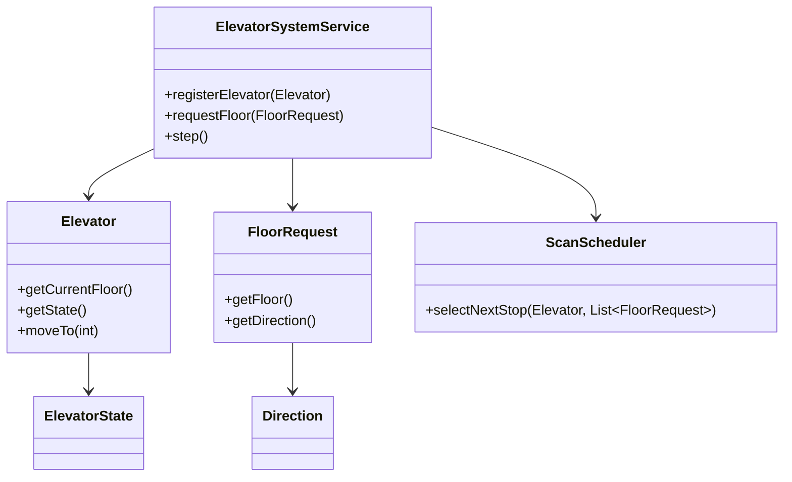
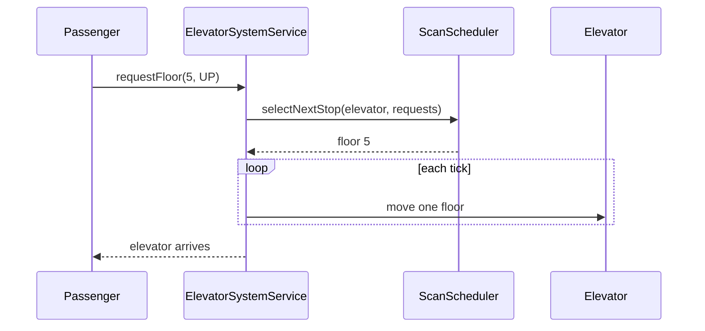

# Problem 02: Elevator System

## Problem Statement

Design an elevator control system for a building with multiple elevators. The system accepts floor requests from passengers, schedules elevators using a SCAN (elevator scan) algorithm stub, and moves elevators between floors while tracking state.

## Functional Requirements

1. Support multiple elevators, each with a current floor and direction
2. Accept floor requests (floor number + desired travel direction)
3. Assign requests to an elevator using SCAN scheduling (stub implementation)
4. Move elevators one floor at a time toward the next scheduled stop
5. Track elevator state: idle, moving, doors open

## Out of Scope

- Database / persistence
- REST APIs / Spring Boot
- Distributed deployment
- Weight sensors and fire/emergency overrides

## Class Diagram

## Sequence Diagram (Key Flow)

## API Surface

| Method | Description |
|--------|-------------|
| `registerElevator(Elevator)` | Add elevator to the system |
| `requestFloor(FloorRequest)` | Queue a passenger floor request |
| `step()` | Advance simulation one tick (move elevators) |
| `getElevator(int id)` | Lookup elevator by id |

## Design Patterns

- **Strategy**: `ScanScheduler` for SCAN vs FCFS scheduling
- **State**: `ElevatorState` enum models idle / moving / doors open
- **Observer** (extension): notify floors when elevator arrives

## Extension Questions

1. How would you optimize for peak-hour traffic with express elevators?
2. How do you handle concurrent requests thread-safely?
3. How would you extend SCAN to support multiple elevator banks?

## Package

`com.lld.problems.elevator`

## Test Class

`ElevatorTest`
