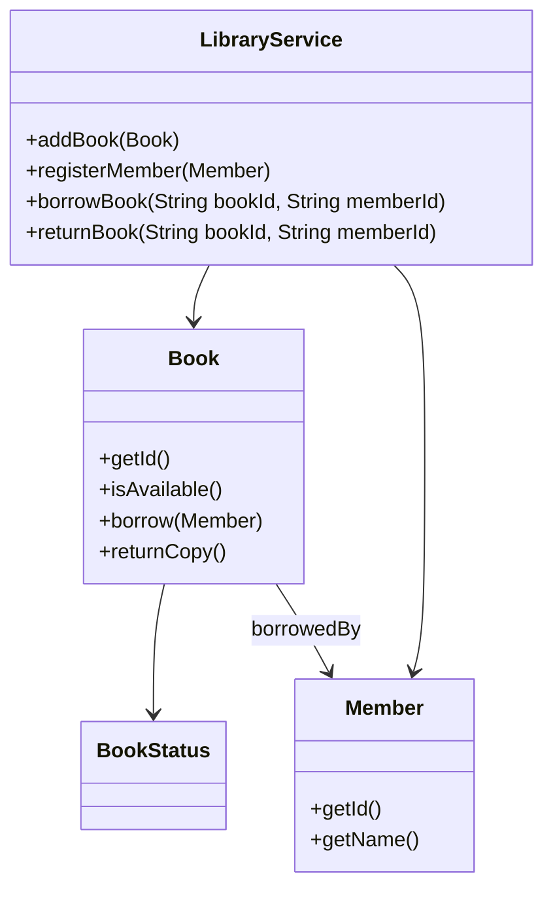
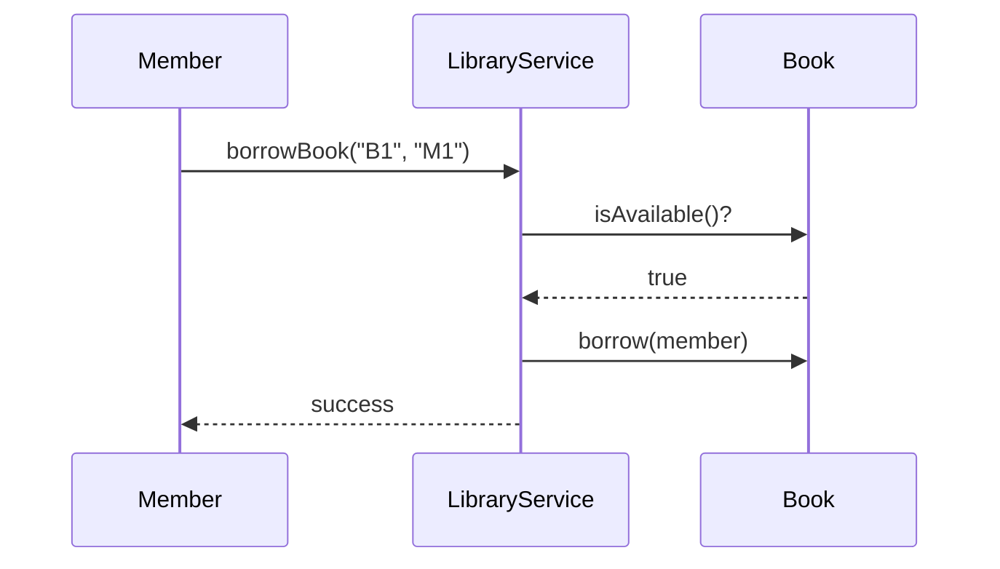

# Problem 03: Library Management

## Problem Statement

Design a library system that manages a catalog of books and registered members. Members can borrow available books and return them, with the system tracking who holds each copy.

## Functional Requirements

1. Register books and members in the catalog
2. Allow a member to borrow an available book (one copy per member per book)
3. Allow a member to return a borrowed book
4. Reject borrow when the book is already checked out or member/book not found
5. List books currently borrowed by a member

## Out of Scope

- Database / persistence
- REST APIs / Spring Boot
- Distributed deployment
- Late fees and reservation queues

## Class Diagram

## Sequence Diagram (Key Flow)

## API Surface

| Method | Description |
|--------|-------------|
| `addBook(Book)` | Add book to catalog |
| `registerMember(Member)` | Register library member |
| `borrowBook(bookId, memberId)` | Checkout book to member |
| `returnBook(bookId, memberId)` | Return borrowed book |
| `getBorrowedBooks(memberId)` | List member's active loans |

## Design Patterns

- **Repository** (extension): abstract book/member storage
- **Factory**: create `Book` instances with ISBN validation
- **Observer** (extension): notify when reserved book becomes available

## Extension Questions

1. How would you add a waitlist when a book is unavailable?
2. How do you enforce borrowing limits per member tier?
3. How would you support multiple copies of the same title?

## Package

`com.lld.problems.library`

## Test Class

`LibraryTest`
