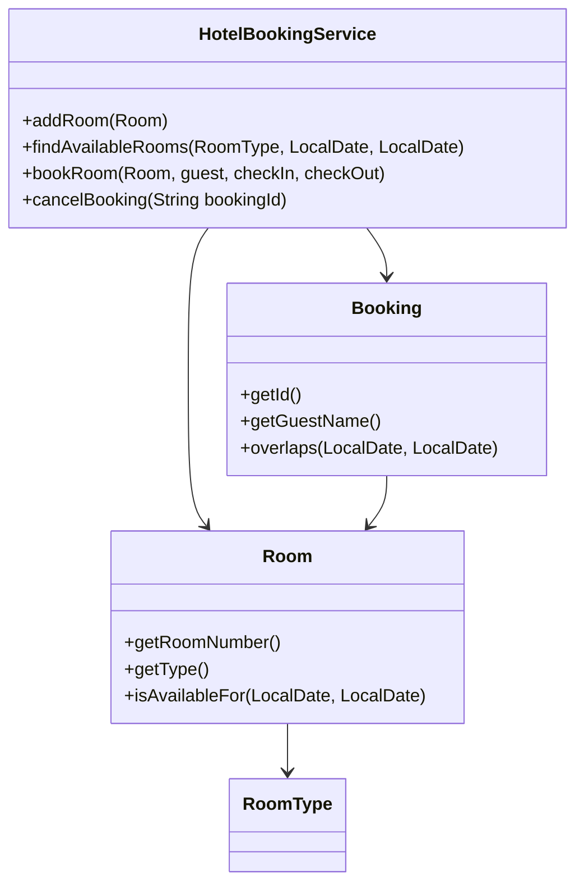
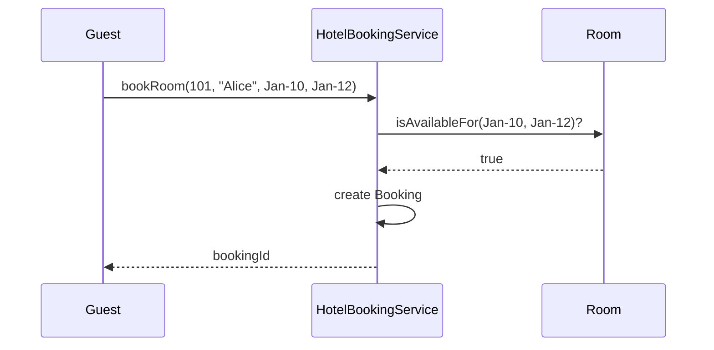

# Problem 04: Hotel Booking

## Problem Statement

Design a hotel room booking system that manages rooms of different types, checks availability for date ranges, and creates or cancels reservations.

## Functional Requirements

1. Register rooms with type (single, double, suite) and room number
2. Search available rooms for a check-in / check-out date range
3. Create a booking for a guest when a room is free for the entire stay
4. Cancel an existing booking and free the room
5. Reject overlapping bookings for the same room

## Out of Scope

- Database / persistence
- REST APIs / Spring Boot
- Distributed deployment
- Payment processing and dynamic pricing

## Class Diagram

## Sequence Diagram (Key Flow)

## API Surface

| Method | Description |
|--------|-------------|
| `addRoom(Room)` | Register a hotel room |
| `findAvailableRooms(type, checkIn, checkOut)` | Search free rooms |
| `bookRoom(room, guest, checkIn, checkOut)` | Create reservation |
| `cancelBooking(bookingId)` | Cancel and release room |
| `getBooking(bookingId)` | Lookup booking |

## Design Patterns

- **Strategy**: pricing by `RoomType` and season
- **Factory**: room creation by type
- **Composite** (extension): block bookings across room blocks

## Extension Questions

1. How would you handle early check-in / late checkout overlaps?
2. How do you add loyalty-tier discounts without breaking availability logic?
3. Thread-safe booking under concurrent guests?

## Package

`com.lld.problems.hotel`

## Test Class

`HotelTest`
