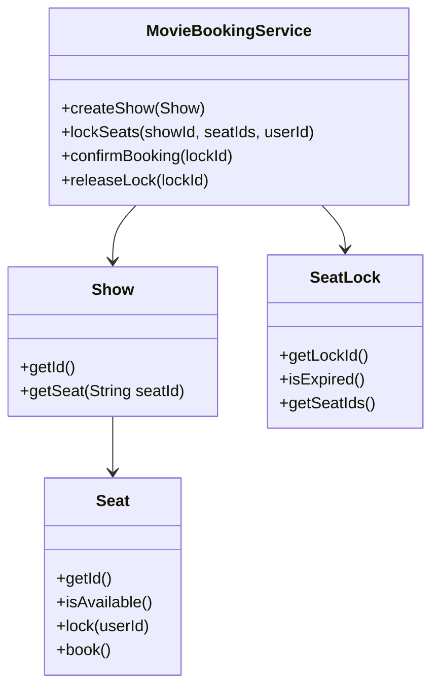
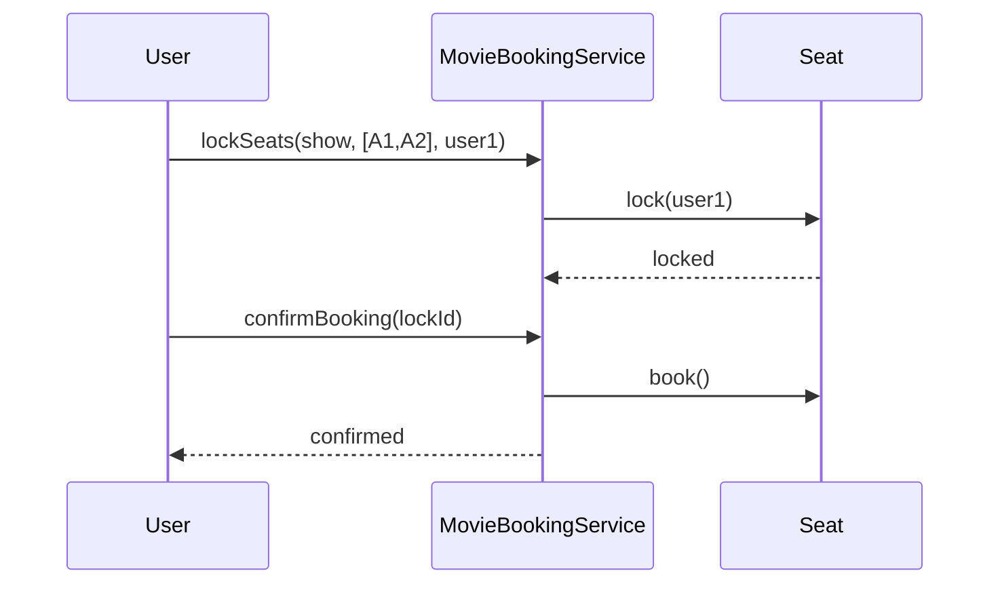

# Problem 05: Movie Ticket Booking

## Problem Statement

Design a movie ticket booking system for a theater show. Users select seats for a show; the system temporarily locks seats during checkout and confirms bookings once payment completes.

## Functional Requirements

1. Create shows with a fixed seat layout
2. Lock selected seats for a limited duration during booking
3. Confirm booking and mark seats as sold after successful lock
4. Reject booking if seats are already sold or lock expired
5. Release locks when booking is abandoned or times out

## Out of Scope

- Database / persistence
- REST APIs / Spring Boot
- Distributed deployment
- Real payment gateway integration

## Class Diagram

## Sequence Diagram (Key Flow)

## API Surface

| Method | Description |
|--------|-------------|
| `createShow(Show)` | Register a show with seats |
| `lockSeats(showId, seatIds, userId)` | Temporarily hold seats |
| `confirmBooking(lockId)` | Finalize seat purchase |
| `releaseLock(lockId)` | Abandon lock and free seats |
| `getAvailableSeats(showId)` | List unsold seats |

## Design Patterns

- **Strategy**: seat pricing by row/type
- **State**: seat lifecycle (available → locked → booked)
- **Singleton** (extension): single booking coordinator per show

## Concurrency Notes

Seat locks should be checked atomically; use per-show synchronization or `LockableResource` for production extensions.

## Extension Questions

1. How would you prevent double-booking under concurrent users?
2. How do you implement dynamic pricing by seat zone?
3. How would you support waitlists for sold-out shows?

## Package

`com.lld.problems.movieticket`

## Test Class

`MovieTicketTest`
