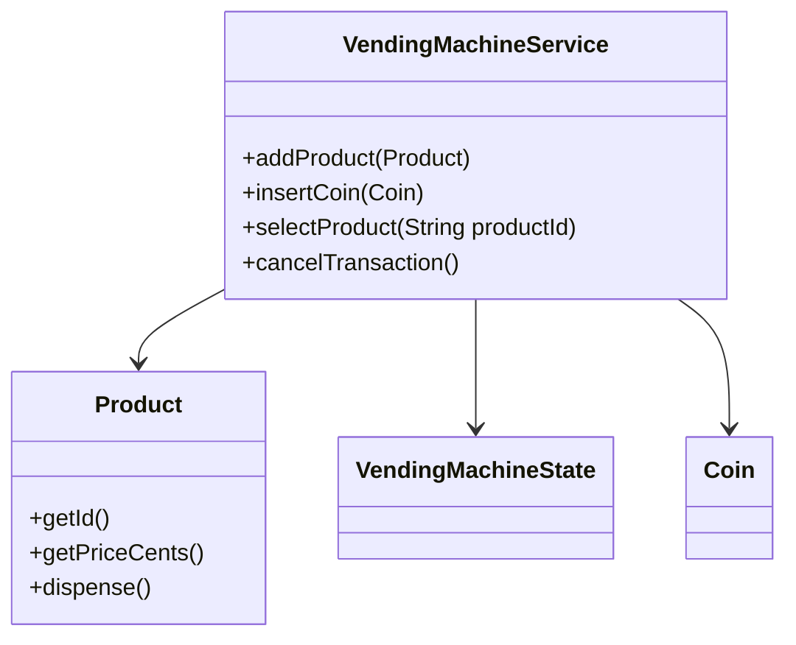
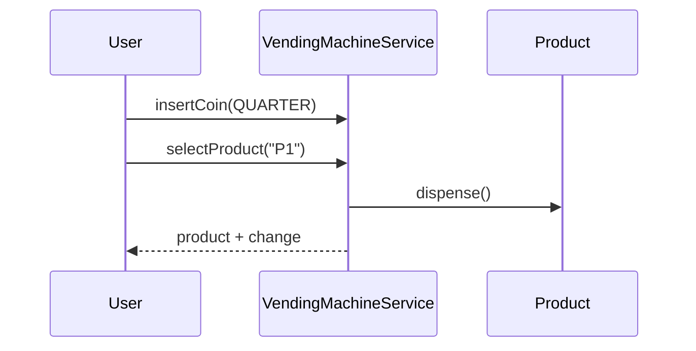

# Problem 06: Vending Machine

## Problem Statement

Design a vending machine that accepts coins, lets a user select a product, dispenses change, and tracks inventory. The machine follows a simple state model for idle, product selection, and dispensing.

## Functional Requirements

1. Load products with name, price, and stock count
2. Accept coin insertion (penny, nickel, dime, quarter, dollar)
3. Allow product selection when inserted amount meets or exceeds price
4. Dispense product and return change; decrement stock
5. Reject selection when out of stock or insufficient funds

## Out of Scope

- Database / persistence
- REST APIs / Spring Boot
- Distributed deployment
- Card / mobile payment

## Class Diagram

## Sequence Diagram (Key Flow)

## API Surface

| Method | Description |
|--------|-------------|
| `addProduct(Product)` | Stock a product slot |
| `insertCoin(Coin)` | Add coin to current balance |
| `selectProduct(productId)` | Purchase if funds sufficient |
| `cancelTransaction()` | Return inserted coins |
| `getCurrentBalanceCents()` | Current inserted amount |

## Design Patterns

- **State**: `VendingMachineState` for idle / selecting / dispensing
- **Strategy**: change-making algorithm (greedy vs optimal)
- **Factory**: product slot initialization

## Extension Questions

1. How would you support multi-product carts?
2. How do you handle exact-change-only scenarios?
3. Thread-safe coin insertion under concurrent misuse attempts?

## Package

`com.lld.problems.vendingmachine`

## Test Class

`VendingMachineTest`
