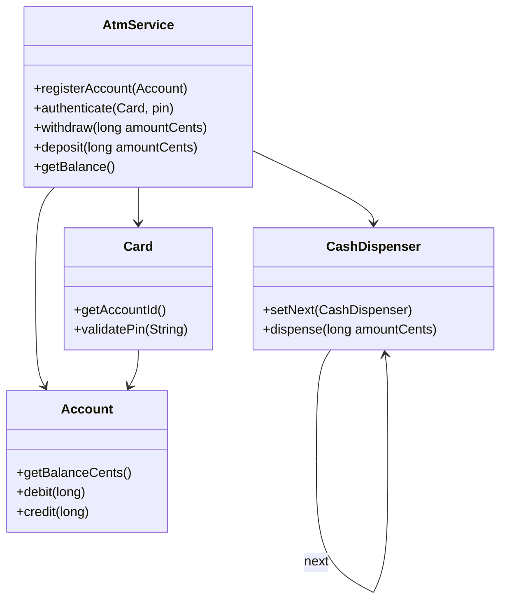
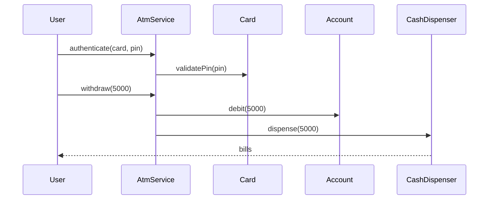

# Problem 07: ATM

## Problem Statement

Design an ATM that authenticates a card and PIN, supports balance inquiry, deposits, and withdrawals. Cash dispensing uses a chain of responsibility across bill denominations.

## Functional Requirements

1. Register accounts linked to cards with PIN
2. Authenticate card + PIN before operations
3. Check balance for authenticated session
4. Deposit funds into account
5. Withdraw cash using bill dispensers (chain: $20 → $10 → $5); reject insufficient account or ATM cash

## Out of Scope

- Database / persistence
- REST APIs / Spring Boot
- Distributed deployment
- Network switch / inter-bank settlement

## Class Diagram

## Sequence Diagram (Key Flow)

## API Surface

| Method | Description |
|--------|-------------|
| `registerAccount(Account)` | Add account to ATM |
| `authenticate(Card, pin)` | Start authenticated session |
| `getBalance()` | Current account balance |
| `deposit(amountCents)` | Credit account |
| `withdraw(amountCents)` | Debit and dispense cash |

## Design Patterns

- **Chain of Responsibility**: `CashDispenser` bill breakdown
- **Facade**: `AtmService` coordinates card, account, dispenser
- **State** (extension): ATM modes (idle, authenticated, dispensing)

## Extension Questions

1. How would you support multi-account cards?
2. How do you make withdrawal atomic when dispenser fails mid-dispense?
3. How would you log transactions for audit?

## Package

`com.lld.problems.atm`

## Test Class

`AtmTest`
