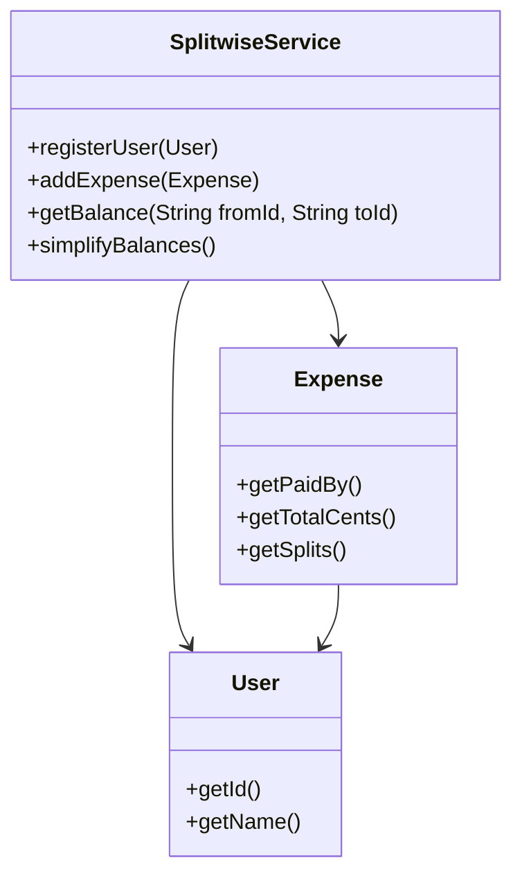
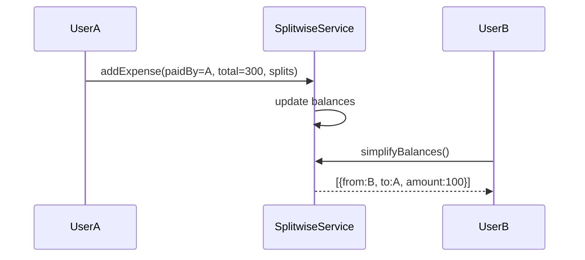

# Problem 08: Splitwise

## Problem Statement

Design an expense-sharing system where users record shared expenses and the system tracks who owes whom. Provide balance simplification to minimize the number of settlement transactions.

## Functional Requirements

1. Register users in the system
2. Record an expense paid by one user and split equally or by custom shares among participants
3. Query net balance between any two users
4. Simplify balances into a minimal set of settlement payments
5. Reject invalid splits (amounts don't sum to expense total)

## Out of Scope

- Database / persistence
- REST APIs / Spring Boot
- Distributed deployment
- Real payment settlement / UPI integration

## Class Diagram

## Sequence Diagram (Key Flow)

## API Surface

| Method | Description |
|--------|-------------|
| `registerUser(User)` | Add participant |
| `addExpense(Expense)` | Record shared expense |
| `getBalance(fromId, toId)` | Net amount `from` owes `to` |
| `simplifyBalances()` | Minimal settlement list |
| `getAllBalances()` | Full balance matrix |

## Design Patterns

- **Strategy**: equal vs percentage vs exact-amount split
- **Graph algorithm**: balance simplification via net settlement
- **Repository** (extension): expense history storage

## Extension Questions

1. How would you support group wallets with multiple currencies?
2. How do you handle recurring expenses and subscriptions?
3. How would you audit and reverse a wrongly recorded expense?

## Package

`com.lld.problems.splitwise`

## Test Class

`SplitwiseTest`
