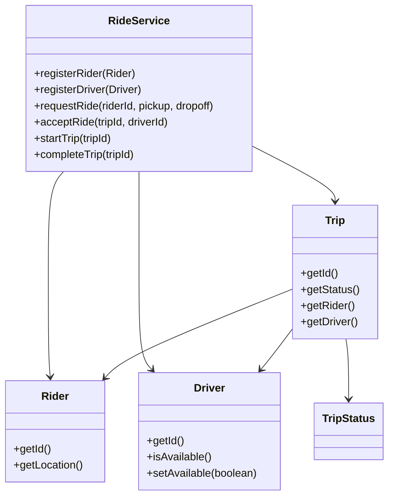
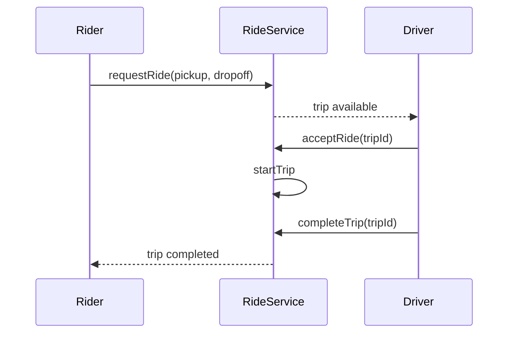

# Problem 09: Ride Hailing

## Problem Statement

Design a ride-hailing platform connecting riders with nearby drivers. Riders request trips, drivers accept requests, and trips progress through a defined status lifecycle until completion.

## Functional Requirements

1. Register riders and drivers with current location
2. Rider requests a trip from pickup to drop-off location
3. Assign or allow a nearby available driver to accept the trip
4. Track trip status: requested → accepted → in progress → completed
5. Mark driver available again after trip completion

## Out of Scope

- Database / persistence
- REST APIs / Spring Boot
- Distributed deployment
- Surge pricing and map routing APIs

## Class Diagram

## Sequence Diagram (Key Flow)

## API Surface

| Method | Description |
|--------|-------------|
| `registerRider(Rider)` | Add rider to platform |
| `registerDriver(Driver)` | Add driver to platform |
| `requestRide(riderId, pickup, dropoff)` | Create trip request |
| `acceptRide(tripId, driverId)` | Driver accepts trip |
| `startTrip(tripId)` | Begin ride |
| `completeTrip(tripId)` | Finish ride, free driver |

## Design Patterns

- **State**: `TripStatus` lifecycle transitions
- **Strategy**: driver matching (nearest, rating-based)
- **Observer** (extension): real-time location updates to rider

## Extension Questions

1. How would you match drivers using geospatial indexes?
2. How do you handle driver cancellation mid-trip?
3. How would you add shared/pooled rides?

## Package

`com.lld.problems.ridehailing`

## Test Class

`RideHailingTest`
