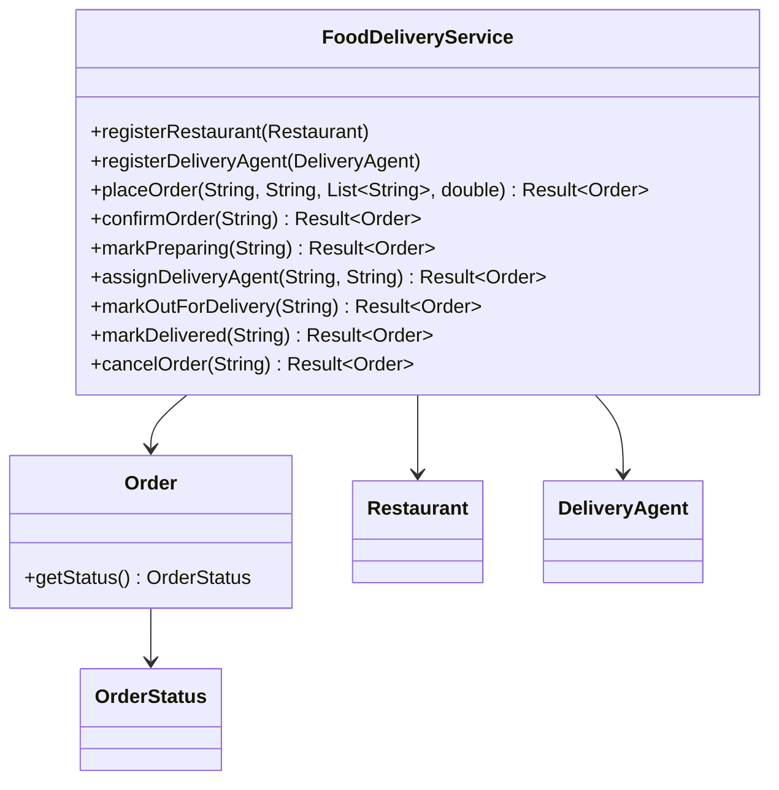
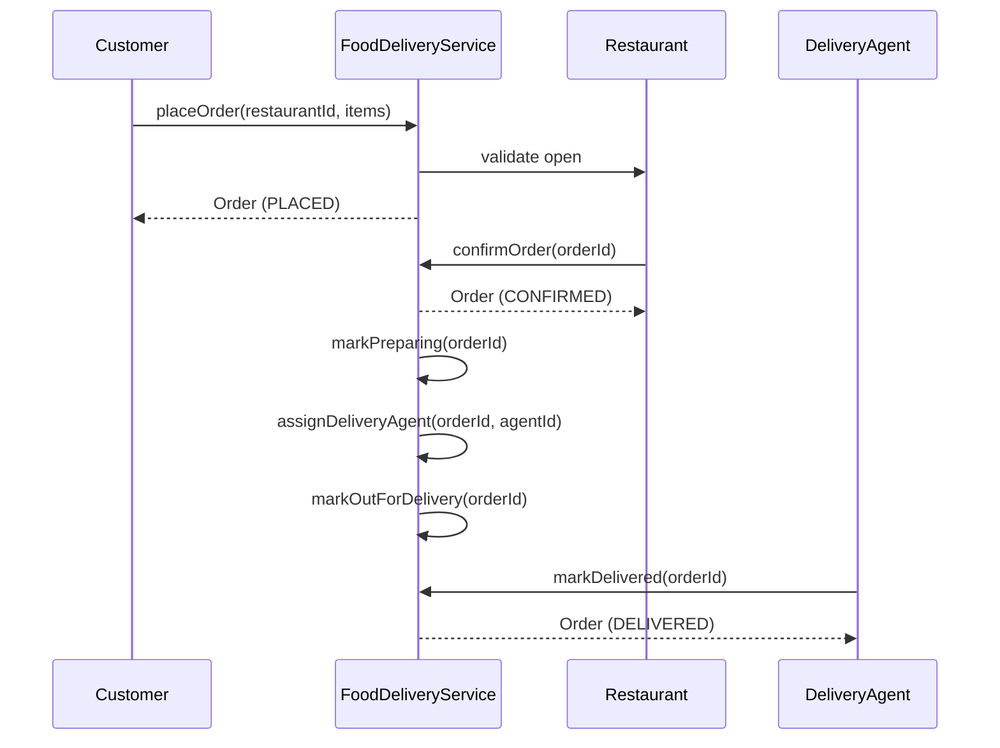

# Problem 10: Food Delivery

## Problem Statement

Design a food delivery platform where customers place orders at restaurants, restaurants confirm and prepare food, and delivery agents pick up and deliver orders. The system tracks order lifecycle from placement through delivery.

## Functional Requirements

1. Customers place orders at a registered restaurant with line items and total amount
2. Restaurants confirm or reject incoming orders
3. Assign available delivery agents when an order is ready for pickup
4. Track order status through a defined state machine (placed → confirmed → preparing → out for delivery → delivered)
5. Allow cancellation only before food preparation starts
6. List orders by customer, restaurant, or delivery agent

## Out of Scope

- Real-time GPS tracking and route optimization
- Payment gateway integration
- Restaurant menu search and recommendations
- Multi-restaurant orders in a single checkout

## Class Diagram

## Sequence Diagram (Order Flow)

## API Surface

| Method | Description |
|--------|-------------|
| `registerRestaurant(Restaurant)` | Add restaurant to platform |
| `registerDeliveryAgent(DeliveryAgent)` | Register delivery agent |
| `placeOrder(customerId, restaurantId, items, total)` | Create order in PLACED state |
| `confirmOrder(orderId)` | Restaurant accepts order |
| `markPreparing(orderId)` | Kitchen starts preparation |
| `assignDeliveryAgent(orderId, agentId)` | Bind agent to order |
| `markOutForDelivery(orderId)` | Agent picked up food |
| `markDelivered(orderId)` | Complete delivery |
| `cancelOrder(orderId)` | Cancel if not yet preparing |
| `getOrder(orderId)` | Lookup order by id |

## Design Patterns

- **State**: `OrderStatus` governs valid transitions (placed → confirmed → preparing → out for delivery → delivered)
- **Strategy**: Delivery fee / ETA calculation (extension)
- **Repository**: In-memory maps for orders, restaurants, agents

## Concurrency Notes

- Agent assignment should be atomic — two orders must not grab the same available agent
- Order status updates benefit from synchronized transitions or optimistic locking on version field

## Extension Questions

1. How would you handle order timeouts when a restaurant never confirms?
2. How do you batch multiple orders for one delivery agent on a route?
3. How would you add surge pricing during peak hours?

## Package

`com.lld.problems.fooddelivery`

## Test Class

`FoodDeliveryTest`
