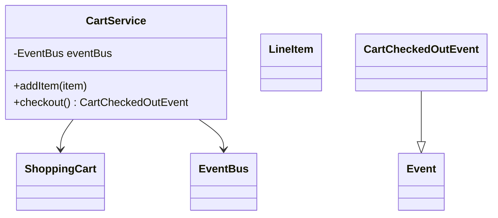
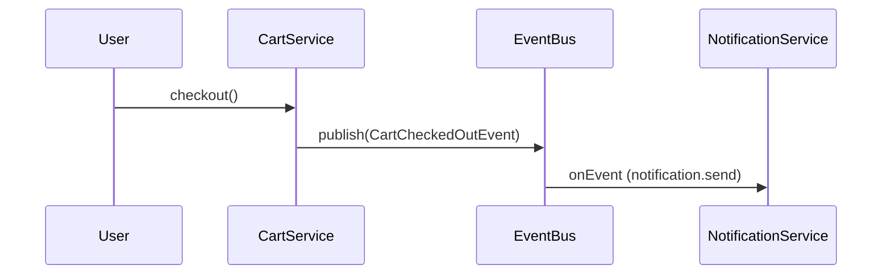

# Problem 11: Shopping Cart & Checkout

## Problem Statement

Design a shopping cart and checkout flow where cart mutations and checkout completion emit domain events on the shared `EventBus`. Downstream services (inventory, analytics, notifications) subscribe without the cart knowing their details.

## Functional Requirements

1. Add/remove/update line items in a session cart
2. Apply pricing rules and compute checkout total
3. On checkout, publish `CartCheckedOutEvent` to the shared bus
4. Support pluggable discount strategies

## Out of Scope

- Payment processing and PCI compliance
- Persistent carts across devices
- Inventory reservation (handled by Problem 25 pipeline)

## Pub-Sub Architecture

```mermaid
flowchart TB
    CartService -->|CartCheckedOutEvent| EventBus
    EventBus --> NotificationService
    EventBus --> InventoryListener
    EventBus --> AnalyticsListener
    subgraph shared [Shared Infrastructure]
        EventBus[com.lld.common.events.EventBus]
        InMemoryEventBus[InMemoryEventBus]
    end
    InMemoryEventBus ..|> EventBus
```

> **Shared EventBus**: Cart checkout publishes to `com.lld.common.events.EventBus` — the same abstraction used in [Problem 22 (Notification Service)](22-notification-service.md) and Pub-Sub problems 21–25. Wire one `InMemoryEventBus` instance across cart and notification demos to show end-to-end decoupling.

## Class Diagram



## Sequence Diagram (Checkout → Notification)



## API Surface

| Method | Description |
|--------|-------------|
| `addItem(LineItem)` | Mutate cart |
| `checkout()` | Validate, publish event, clear cart |
| Topic: `cart.checkout` | Checkout event channel |

## Design Patterns

- **Strategy**: discount/pricing rules
- **Observer / EventBus**: post-checkout side effects
- **Shared EventBus**: links cart to notification and pipeline problems

## Extension Questions

1. How would you add an outbox table before publishing events?
2. How do you handle checkout idempotency?
3. When should cart events use async delivery?

## Package

`com.lld.problems.shoppingcart` (scaffold pending)

## Test Class

`ShoppingCartTest` (scaffold pending)
