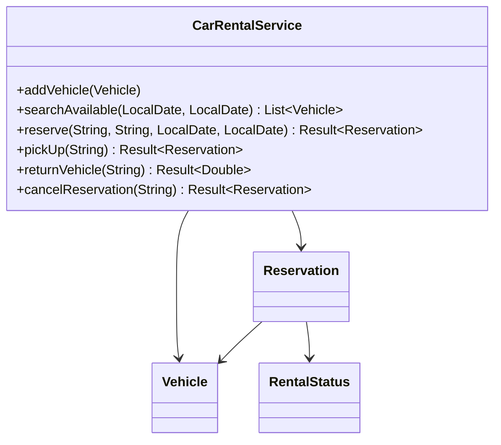
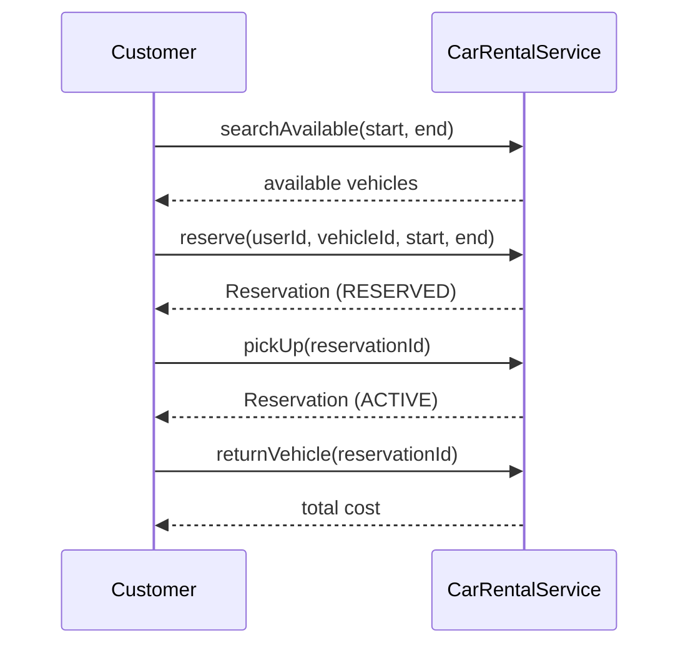

# Problem 12: Car Rental

## Problem Statement

Design a car rental system where customers search for available vehicles, make reservations for date ranges, pick up and return vehicles, and track rental status through the reservation lifecycle.

## Functional Requirements

1. Maintain a fleet of vehicles with type, daily rate, and availability
2. Search vehicles available for a given date range
3. Create reservations that block the vehicle for the requested period
4. Transition reservation from RESERVED → ACTIVE on pickup and ACTIVE → COMPLETED on return
5. Calculate rental cost based on daily rate and duration
6. Cancel reservations before pickup

## Out of Scope

- Insurance add-ons and damage assessment
- Multi-location fleet transfers
- Loyalty programs and dynamic pricing
- GPS telematics and mileage overage billing

## Class Diagram

## Sequence Diagram (Reservation Flow)

## API Surface

| Method | Description |
|--------|-------------|
| `addVehicle(Vehicle)` | Register fleet vehicle |
| `searchAvailable(start, end)` | List vehicles with no overlapping reservation |
| `reserve(userId, vehicleId, start, end)` | Create reservation |
| `pickUp(reservationId)` | Start rental |
| `returnVehicle(reservationId)` | End rental, return cost |
| `cancelReservation(reservationId)` | Cancel if still RESERVED |
| `getReservation(reservationId)` | Lookup reservation |

## Design Patterns

- **State**: `RentalStatus` for reservation lifecycle
- **Strategy**: Pricing rules (weekend surcharge, vehicle type multiplier)
- **Repository**: `InMemoryRepository` for vehicles and reservations

## Concurrency Notes

- Two concurrent `reserve` calls for the same vehicle and overlapping dates must not both succeed
- Use synchronized block or lock per vehicle id during availability check + reservation insert

## Extension Questions

1. How do you handle early return refunds?
2. How would you support one-way rentals between locations?
3. How do you prevent double-booking under high concurrency?

## Package

`com.lld.problems.carrental`

## Test Class

`CarRentalTest`
