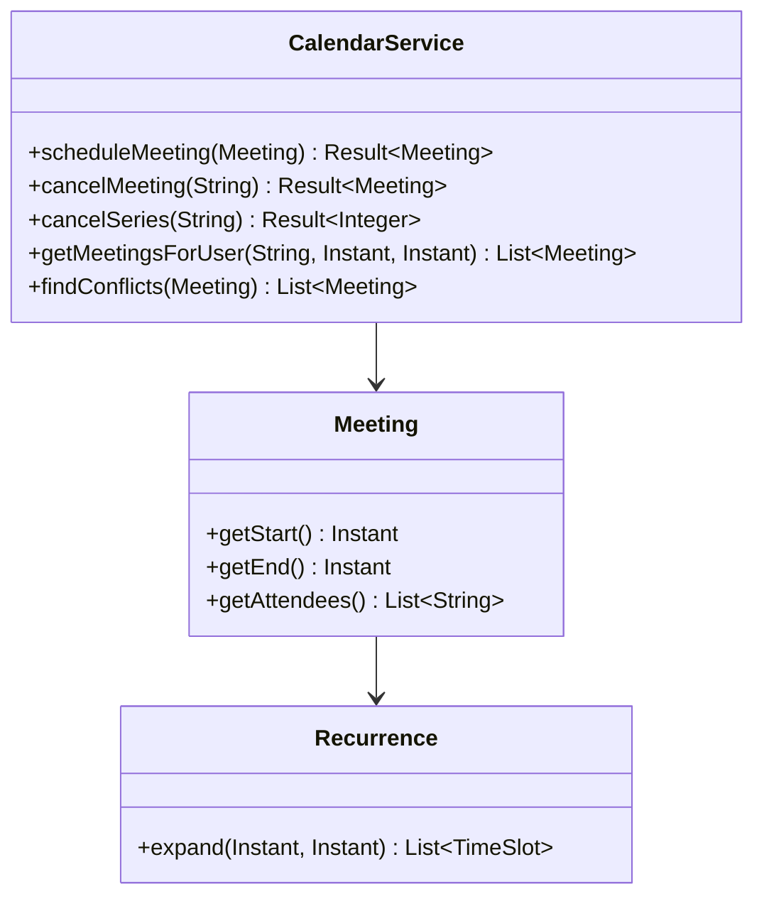
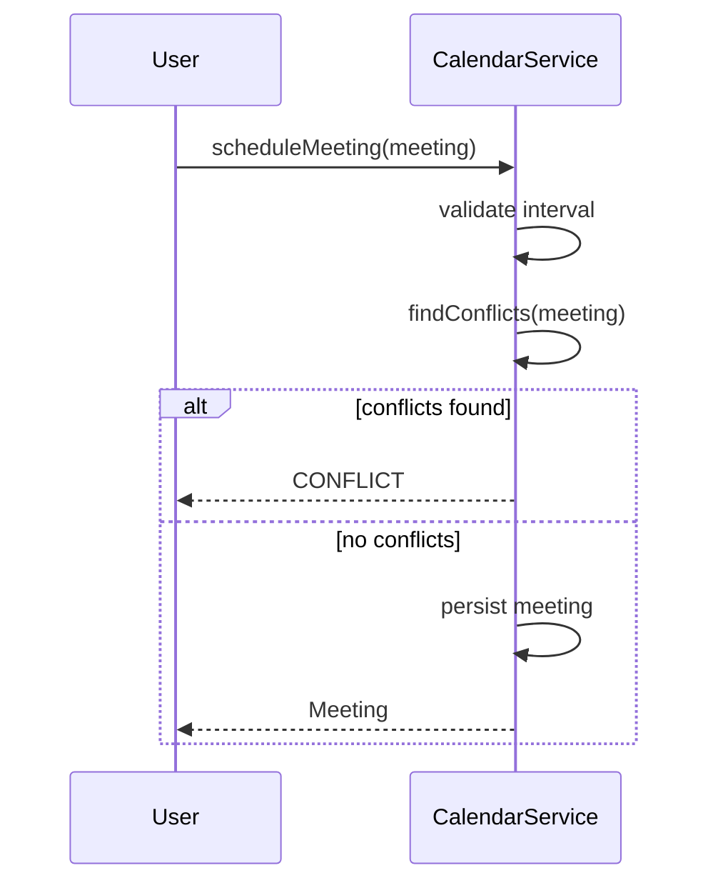

# Problem 13: Meeting Scheduler (Calendar)

## Problem Statement

Design a calendar service that schedules meetings for users, supports recurring meetings, detects scheduling conflicts, and allows cancellation. Users should not have overlapping meetings on their calendar.

## Functional Requirements

1. Schedule a meeting with title, start/end time, organizer, and attendee list
2. Detect conflicts for any attendee against existing meetings (including recurring instances)
3. Support recurrence rules: none, daily, weekly
4. Cancel a single meeting or an entire recurring series
5. Query meetings for a user within a time range
6. Reject invalid intervals (end before start) and conflicting schedules

## Out of Scope

- Time zone conversion and daylight saving edge cases
- External calendar sync (Google, Outlook)
- Room/resource booking
- Meeting reminders and video conferencing links

## Class Diagram

## Sequence Diagram (Schedule with Conflict Check)

## API Surface

| Method | Description |
|--------|-------------|
| `scheduleMeeting(Meeting)` | Create meeting after conflict check |
| `cancelMeeting(meetingId)` | Cancel single instance |
| `cancelSeries(seriesId)` | Cancel all instances in series |
| `getMeetingsForUser(userId, from, to)` | Range query |
| `findConflicts(Meeting)` | Preview conflicts without saving |
| `getMeeting(meetingId)` | Lookup by id |

## Design Patterns

- **Interval Tree / Sweep Line**: Efficient conflict detection (extension)
- **Strategy**: Recurrence expansion algorithms
- **Composite**: Recurring series as parent + generated instances

## Concurrency Notes

- Schedule + conflict check should be atomic per attendee to prevent race-induced double booking
- Recurrence expansion can be lazy (on query) or eager (on schedule)

## Extension Questions

1. How do you handle exceptions to a recurring series (skip one instance)?
2. How would you add optional attendees vs required attendees?
3. How do you scale conflict detection for thousands of meetings per user?

## Package

`com.lld.problems.calendar`

## Test Class

`CalendarTest`
