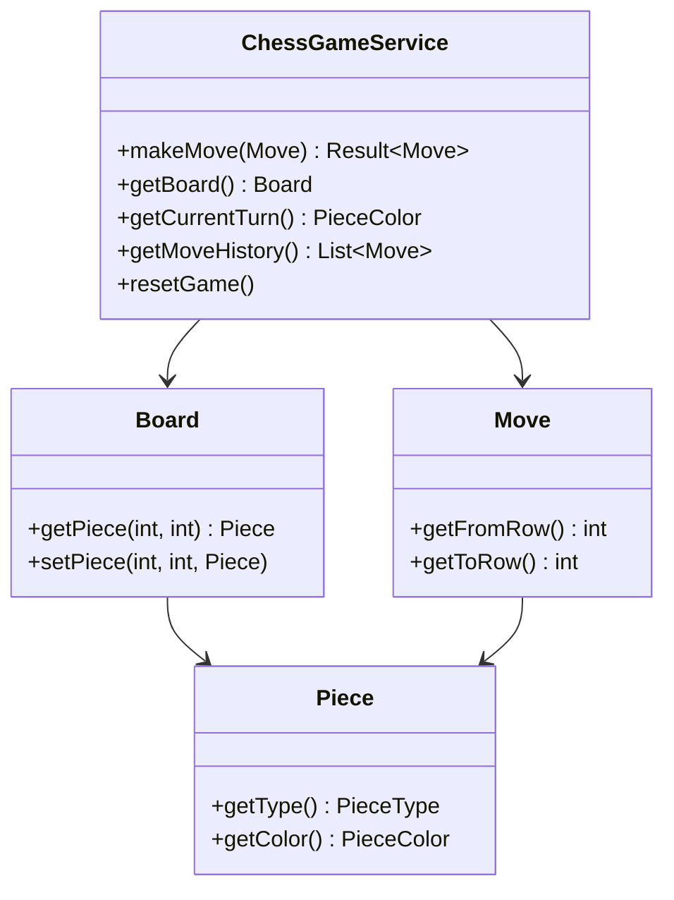
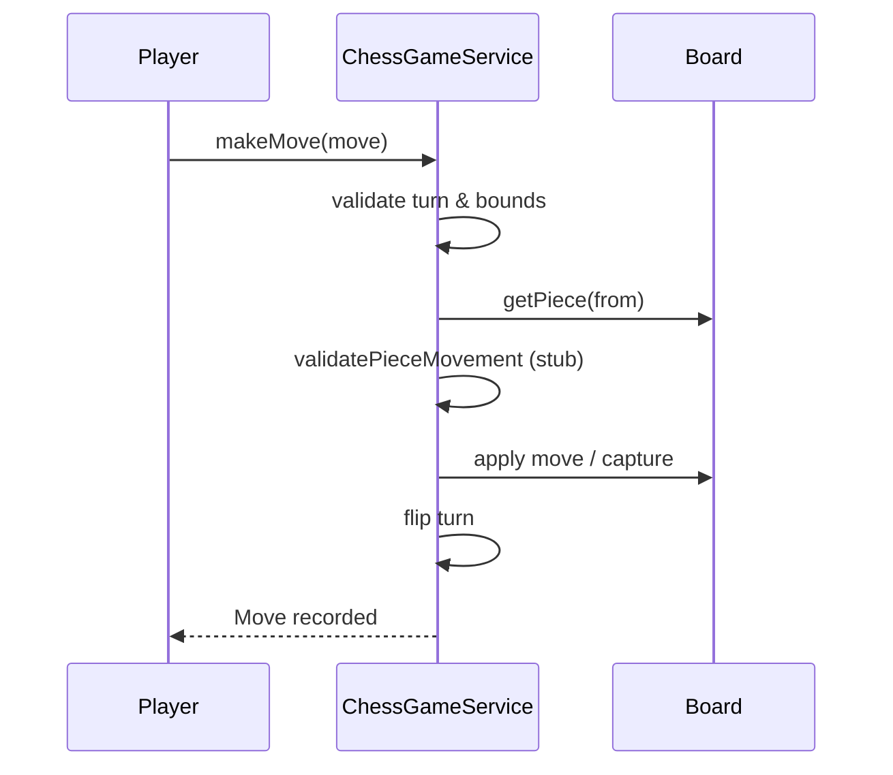

# Problem 14: Chess Game

## Problem Statement

Design a chess game engine skeleton that maintains board state, records moves, validates basic move rules, and tracks turn order. Full piece-specific rules (castling, en passant, checkmate) are left as extension work.

## Functional Requirements

1. Initialize a standard 8×8 board with pieces in starting positions
2. Alternate turns between white and black
3. Validate moves: correct player's turn, source square occupied, destination in bounds
4. Stub advanced validation — piece-specific movement rules marked as TODO
5. Capture opponent pieces when moving to an occupied square
6. Expose game state: current turn, move history, board snapshot
7.  Check, checkmate, and stalemate detection
8.Castling, en passant, pawn promotion

## Out of Scope
- AI opponent and move suggestion
- Network multiplayer and clock/time controls

## Class Diagram

## Sequence Diagram (Make Move)

## API Surface

| Method | Description |
|--------|-------------|
| `makeMove(Move)` | Apply move if valid |
| `getBoard()` | Current board state |
| `getCurrentTurn()` | WHITE or BLACK |
| `getMoveHistory()` | Ordered list of moves |
| `resetGame()` | Restore initial position |

## Design Patterns

- **Command**: Each `Move` encapsulates an action with undo potential (extension)
- **Strategy**: Per-piece movement validators (`PawnStrategy`, `KnightStrategy`, …)
- **Memento**: Board snapshots for replay (extension)

## Concurrency Notes

- Single-player / local two-player — no concurrency requirements in base problem
- Online multiplayer would require move serialization per game id

## Extension Questions

1. How do you implement check detection efficiently?
2. How would you add undo/redo using the Command pattern?
3. How do you generate legal moves for a piece without infinite recursion on pinned pieces?

## Package

`com.lld.problems.chess`

## Test Class

`ChessGameTest`
