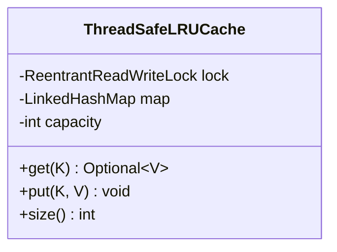
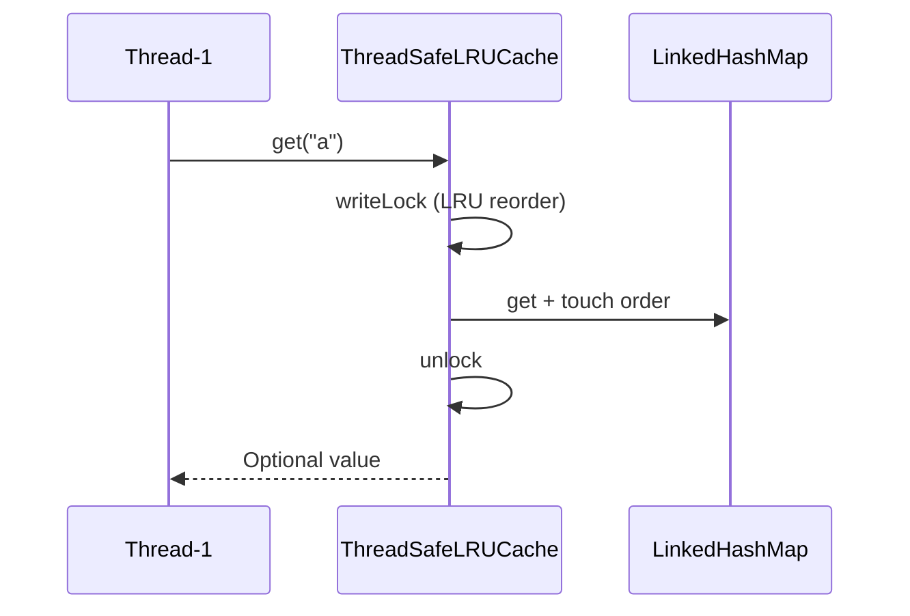

# Problem 15: Thread-safe LRU Cache

## Problem Statement

Design a fixed-capacity Least Recently Used (LRU) cache that supports concurrent reads and writes from multiple threads while preserving O(1) `get` and `put` operations.

## Functional Requirements

1. `get(key)` returns the value and marks the entry as most recently used
2. `put(key, value)` inserts or updates; evicts the LRU entry when at capacity
3. All operations are thread-safe under concurrent access
4. Capacity is fixed at construction time

## Out of Scope

- Distributed cache / Redis
- Persistence to disk
- TTL-based expiration (see extension)

## Class Diagram

## Sequence Diagram (Concurrent Get)

## API Surface

| Method | Description |
|--------|-------------|
| `get(K key)` | Returns value if present; updates recency |
| `put(K key, V value)` | Inserts/updates; evicts LRU when full |
| `size()` | Current entry count |
| `capacity()` | Maximum entries |

## Design Patterns

- **Decorator-style locking**: `ReentrantReadWriteLock` guards an access-ordered `LinkedHashMap`
- **Eviction policy**: LRU via `LinkedHashMap` `removeEldestEntry`

## Concurrency Notes

- **Why write lock on `get`?** LRU requires reordering on access; that mutates the linked list inside `LinkedHashMap`, so reads are not lock-free.
- **Alternative**: segmented locks or `ConcurrentHashMap` + manual doubly-linked list with per-node locks (more complex, better read throughput).
- **Lock ordering**: single lock — no deadlock risk.
- **Visibility**: all map mutations happen inside lock → happens-before for other threads.
- **Interview follow-up**: discuss read-heavy workloads using a stampede-safe loading cache (single-flight).

## Extension Questions

1. How would you add TTL expiration without breaking O(1)?
2. How does Caffeine differ from this design?
3. When would you shard the cache by key hash?

## Package

`com.lld.problems.lrucache`

## Test Class

`ThreadSafeLRUCacheTest`
