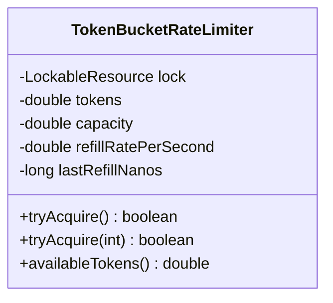
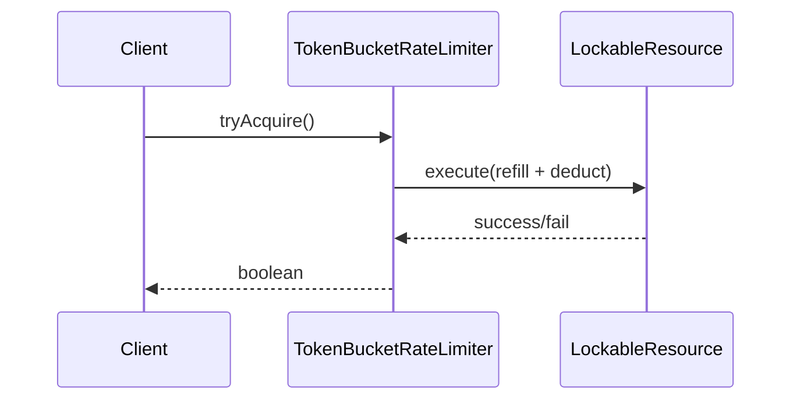

# Problem 16: Rate Limiter (Token Bucket)

## Problem Statement

Implement a thread-safe token-bucket rate limiter that controls how many requests a client may make over time, with automatic token refill based on elapsed wall-clock time.

## Functional Requirements

1. `tryAcquire()` consumes one token if available; returns boolean
2. `tryAcquire(n)` consumes up to `n` tokens atomically
3. Tokens refill continuously at a configured rate up to bucket capacity
4. Safe under concurrent callers

## Out of Scope

- Distributed rate limiting (Redis sliding window)
- Per-user key sharding
- HTTP middleware integration

## Class Diagram

## Sequence Diagram (Refill on Acquire)

## API Surface

| Method | Description |
|--------|-------------|
| `tryAcquire()` | Attempt to take 1 token |
| `tryAcquire(int permits)` | Attempt to take N tokens |
| `availableTokens()` | Snapshot of current balance (approximate under contention) |

## Design Patterns

- **Token Bucket**: smooth burst allowance with steady refill
- **Critical section**: `LockableResource` serializes refill + deduct

## Concurrency Notes

- Refill uses monotonic `System.nanoTime()` to avoid clock skew.
- All state changes (`tokens`, `lastRefillNanos`) occur inside one lock → atomic refill-then-deduct.
- **Thundering herd**: not applicable (no blocking wait); callers spin-retry externally if needed.
- **vs Fixed Window**: token bucket allows controlled bursts; fixed window has boundary spikes.
- **vs Leaky Bucket**: token bucket accumulates idle capacity; leaky bucket drains at fixed rate.

## Extension Questions

1. How would you implement a sliding-window log limiter?
2. How do you rate-limit across multiple JVM instances?
3. When is `tryAcquire(timeout)` useful?

## Package

`com.lld.problems.ratelimiter`

## Test Class

`TokenBucketRateLimiterTest`
