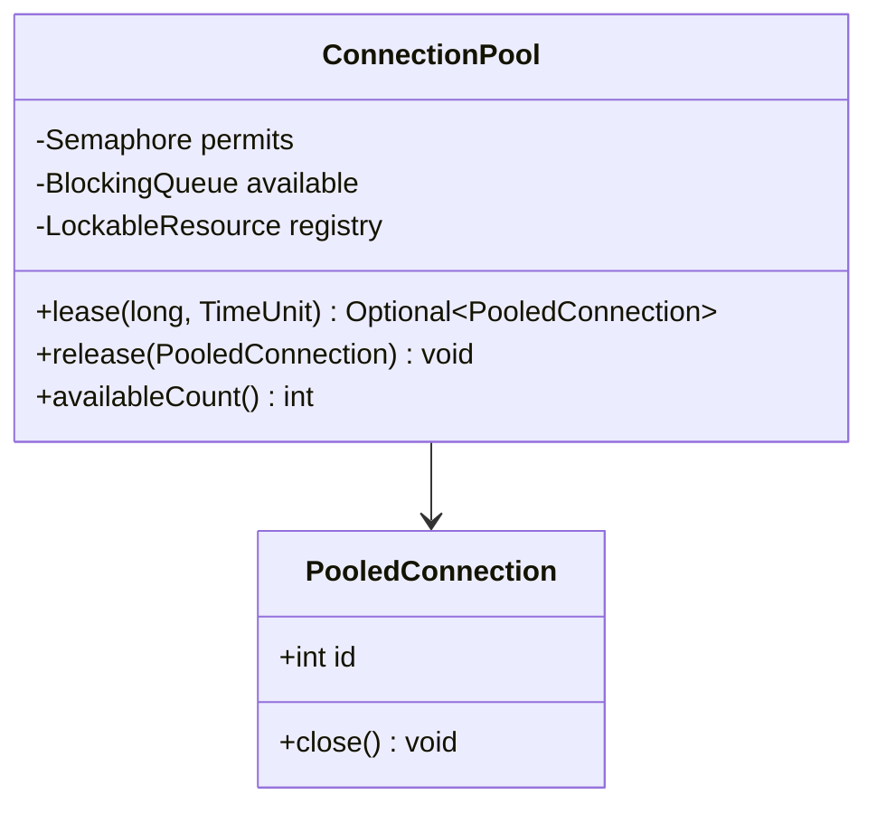
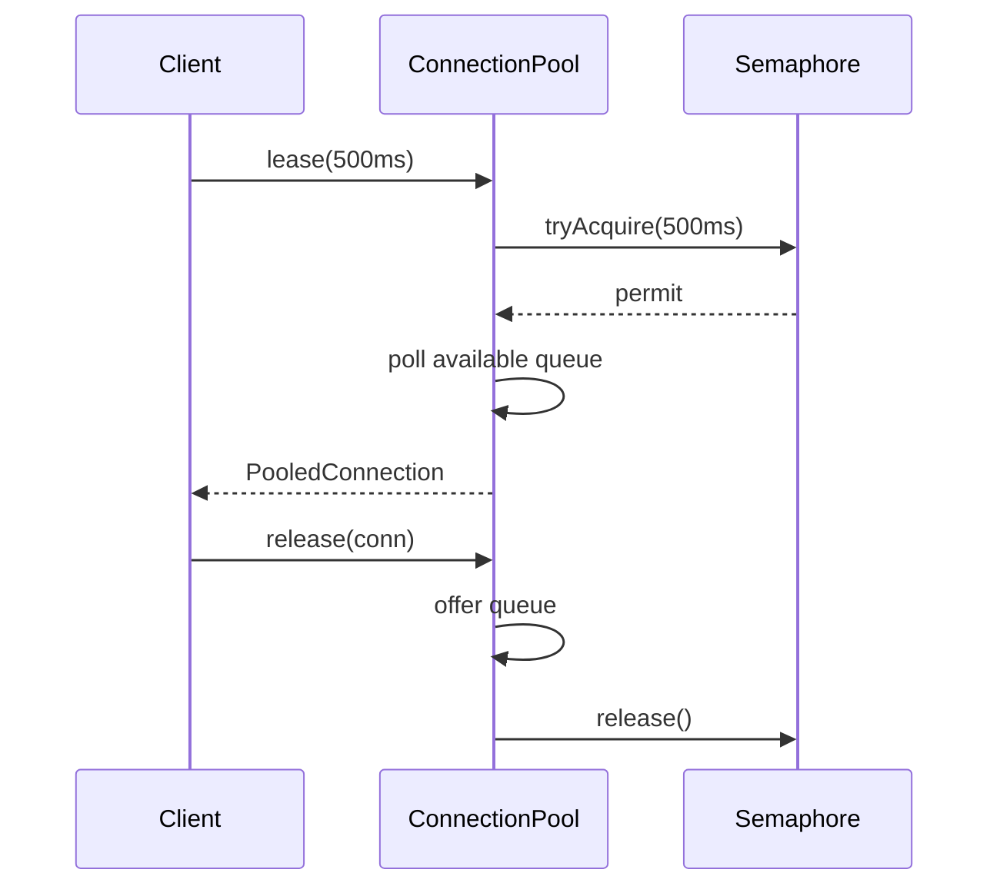

# Problem 17: Connection Pool

## Problem Statement

Design a bounded pool of reusable connections. Callers lease a connection with an optional timeout; when finished, they return it so other threads can reuse it.

## Functional Requirements

1. Pool created with a fixed maximum size
2. `lease(timeout)` blocks up to timeout waiting for an available connection
3. `release(connection)` returns a connection to the pool
4. Reject or timeout when pool is exhausted within the wait window
5. Thread-safe lease and return

## Out of Scope

- Real JDBC / socket I/O
- Connection health checks / validation queries
- Dynamic pool resizing

## Class Diagram

## Sequence Diagram (Lease / Return)

## API Surface

| Method | Description |
|--------|-------------|
| `lease(timeout, unit)` | Obtain a connection or empty if timed out |
| `release(conn)` | Return leased connection |
| `availableCount()` | Idle connections in pool |
| `shutdown()` | Close all connections |

## Design Patterns

- **Object Pool**: reuse expensive connection objects
- **Semaphore**: bounds concurrent leases to `maxSize`
- **LockableResource**: guards leased-set bookkeeping

## Concurrency Notes

- **Semaphore vs lock**: semaphore counts *in-use* slots; queue holds idle objects.
- **Lease tracking**: `ConcurrentHashMap.newKeySet()` tracks outstanding leases to detect double-release.
- **Timeout**: `Semaphore.tryAcquire` avoids indefinite blocking.
- **Deadlock avoidance**: always `release` in `finally`; never hold connection while acquiring another pool resource.
- **Spurious wakeups**: handled by `BlockingQueue.poll` after permit acquired.

## Extension Questions

1. How would you detect and evict stale connections?
2. What happens if `release` is called twice for the same connection?
3. How does HikariCP differ from this design?

## Package

`com.lld.problems.connectionpool`

## Test Class

`ConnectionPoolTest`
