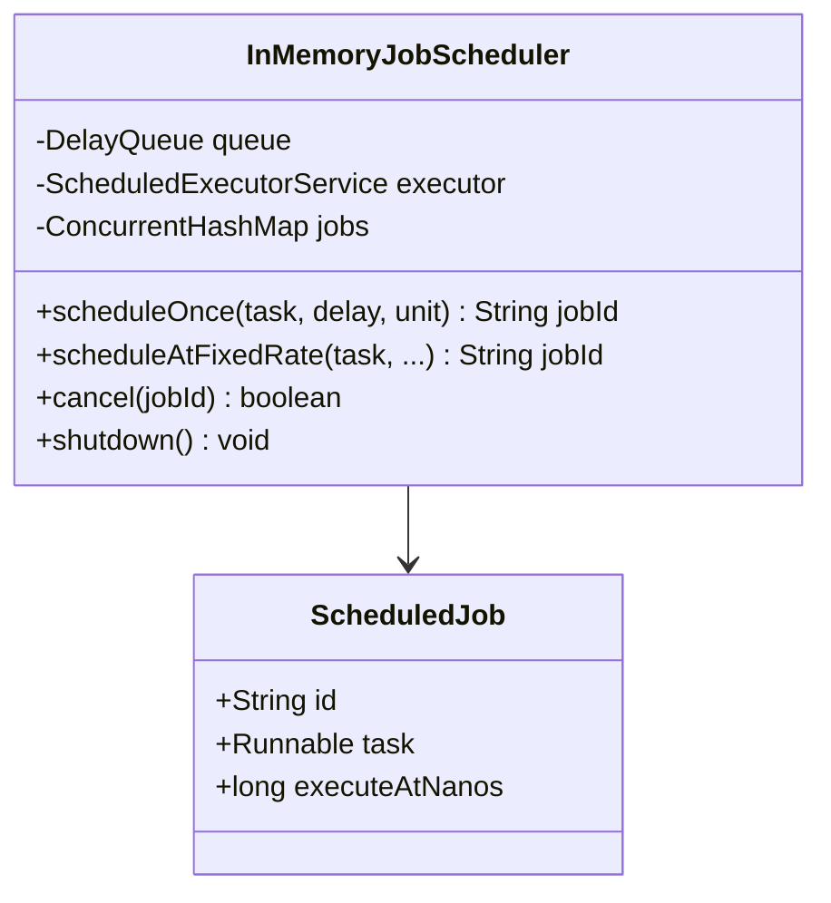
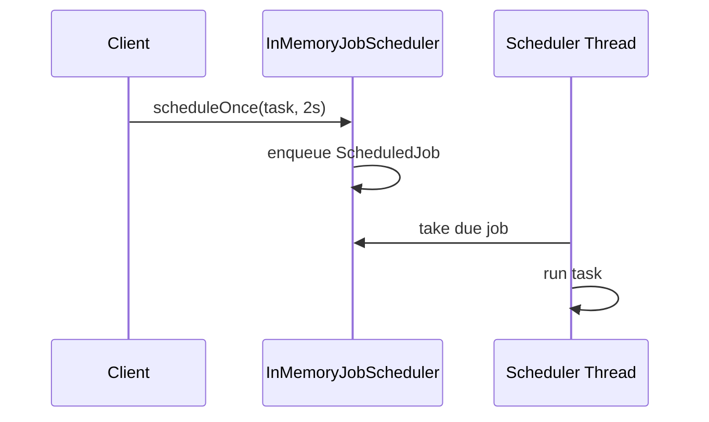

# Problem 18: In-Memory Job Scheduler

## Problem Statement

Build an in-memory scheduler that runs tasks after a delay or at a fixed rate. Jobs should be cancellable and the scheduler must shut down cleanly.

## Functional Requirements

1. `scheduleOnce(task, delay, unit)` runs a task one time after delay
2. `scheduleAtFixedRate(task, initialDelay, period, unit)` repeats at fixed intervals
3. `cancel(jobId)` cancels a pending or recurring job
4. `shutdown()` stops accepting jobs and drains gracefully

## Out of Scope

- Persistent job store / cron DSL parsing
- Distributed scheduling (Quartz cluster)
- Retry with backoff policies

## Class Diagram

## Sequence Diagram (Delayed Job)

## API Surface

| Method | Description |
|--------|-------------|
| `scheduleOnce(task, delay, unit)` | One-shot delayed execution |
| `scheduleAtFixedRate(...)` | Recurring execution |
| `cancel(jobId)` | Remove job; return true if found |
| `shutdown()` | Stop scheduler |
| `awaitTermination(timeout, unit)` | Wait for in-flight tasks |

## Design Patterns

- **DelayQueue**: priority queue ordered by execution time
- **Executor**: dedicated worker thread(s) for dispatch

## Concurrency Notes

- `DelayQueue` is thread-safe; producer threads enqueue, consumer thread(s) block on `take()`.
- Job IDs stored in `ConcurrentHashMap` for O(1) cancel; cancel removes from map (in-flight task may still run once).
- Fixed-rate re-enqueues next execution time after run completes (fixed-rate, not fixed-delay).
- **Shutdown**: `volatile boolean running` + interrupt worker; `awaitTermination` uses `CountDownLatch`.
- **vs ScheduledThreadPoolExecutor**: this scaffold mirrors its API for learning; production code often delegates directly.

## Extension Questions

1. How would you persist jobs across restarts?
2. Fixed-rate vs fixed-delay — when does drift matter?
3. How do you prevent one slow job from starving others?

## Package

`com.lld.problems.jobscheduler`

## Test Class

`InMemoryJobSchedulerTest`
