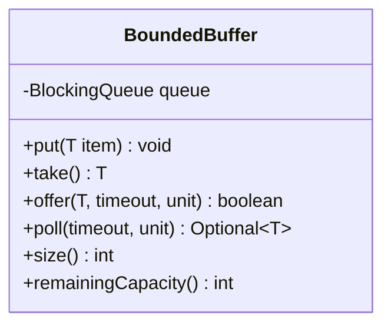
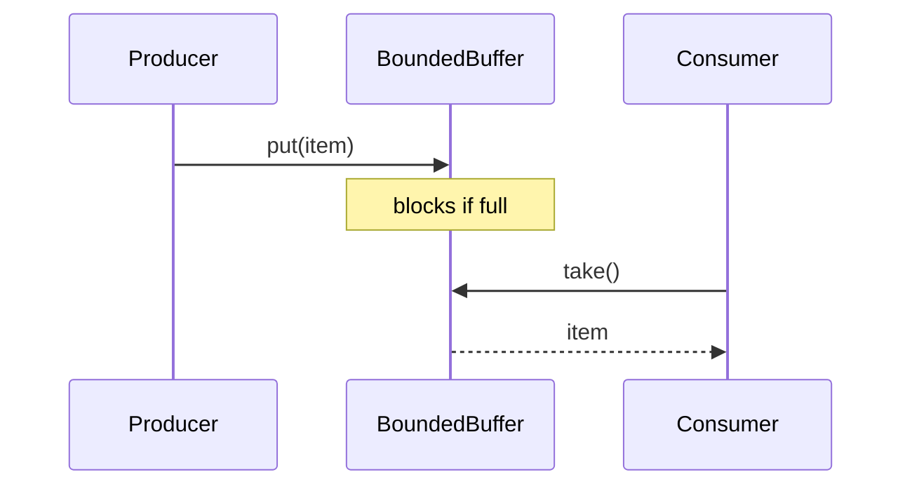

# Problem 19: Producer-Consumer (Bounded Buffer)

## Problem Statement

Implement a bounded buffer where multiple producer threads put items and multiple consumer threads take items. Producers block when full; consumers block when empty.

## Functional Requirements

1. Fixed capacity buffer
2. `put(item)` blocks until space is available
3. `take()` blocks until an item is available
4. `offer(item, timeout)` and `poll(timeout)` support timed waits
5. Safe with multiple producers and consumers

## Out of Scope

- Priority ordering
- Batch put/take
- Back-pressure metrics / monitoring

## Class Diagram

## Sequence Diagram

## API Surface

| Method | Description |
|--------|-------------|
| `put(T)` | Blocking insert |
| `take()` | Blocking remove |
| `offer(T, timeout, unit)` | Timed insert |
| `poll(timeout, unit)` | Timed remove |
| `size()` | Current element count |

## Design Patterns

- **Producer-Consumer**: classic bounded buffer pattern
- **BlockingQueue**: delegates blocking semantics to `ArrayBlockingQueue`

## Concurrency Notes

- `ArrayBlockingQueue` is thread-safe with internal ReentrantLock + two Conditions (notFull, notEmpty).
- **Fairness**: optional fair queue reduces starvation at cost of throughput; default non-fair is faster.
- **Poison pill**: consumers exit when receiving a sentinel value (see test).
- **Lost wakeup**: handled internally by `BlockingQueue`; do not roll your own with `wait/notify` unless asked.
- **Multiple consumers**: each `take()` delivers exactly one item to one consumer — no duplicate delivery.

## Extension Questions

1. When would you choose `LinkedBlockingQueue` over `ArrayBlockingQueue`?
2. How do you implement a blocking buffer without `java.util.concurrent`?
3. How does this relate to the `ThreadPoolExecutor` work queue?

## Package

`com.lld.problems.producerconsumer`

## Test Class

`BoundedBufferTest`
