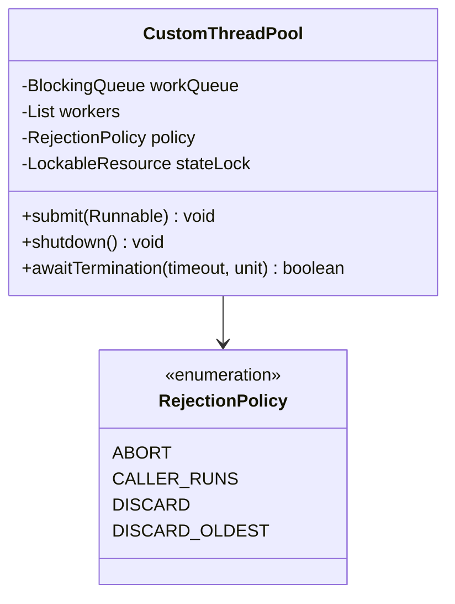
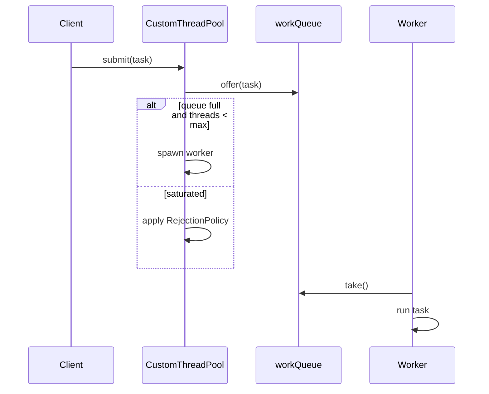

# Problem 20: Custom Thread Pool

## Problem Statement

Implement a simplified `ThreadPoolExecutor`: worker threads pull tasks from a shared queue, the pool bounds concurrency, and saturated submissions follow a configurable rejection policy.

## Functional Requirements

1. Construct with core pool size, max pool size, and bounded work queue
2. `submit(task)` enqueues work; creates threads up to max when queue is full
3. `shutdown()` stops accepting tasks; workers drain the queue
4. `RejectionPolicy` enum: `ABORT`, `CALLER_RUNS`, `DISCARD`, `DISCARD_OLDEST`
5. Thread-safe submission under load

## Out of Scope

- Keep-alive thread reclamation (optional simplification)
- `Future` / `Callable` return values
- Work-stealing deque

## Class Diagram

## Sequence Diagram (Submit)

## API Surface

| Method | Description |
|--------|-------------|
| `submit(Runnable)` | Enqueue or reject task |
| `shutdown()` | Initiate graceful shutdown |
| `awaitTermination(timeout, unit)` | Wait for workers to finish |
| `getActiveCount()` | Running or queued tasks estimate |

## Design Patterns

- **Worker Pool**: fixed set of threads processing shared queue
- **Strategy**: `RejectionPolicy` for saturation behavior

## Concurrency Notes

- Workers block on `workQueue.take()` — parks until work arrives or shutdown interrupt.
- Pool state (`running`, thread count) guarded by `LockableResource` + `volatile boolean`.
- **Caller-runs**: rejection handler executes task on submitting thread — provides back-pressure.
- **Discard oldest**: `ArrayBlockingQueue` does not support removing oldest fairly; implementation removes head then re-offers new task under lock.
- **Shutdown**: set flag, interrupt idle workers, `awaitTermination` joins threads.

## Extension Questions

1. How does `ThreadPoolExecutor` implement core vs max thread counts with keep-alive?
2. When is `CallerRunsPolicy` dangerous?
3. How would you add a `Future` return type?

## Package

`com.lld.problems.threadpool`

## Test Class

`CustomThreadPoolTest`
