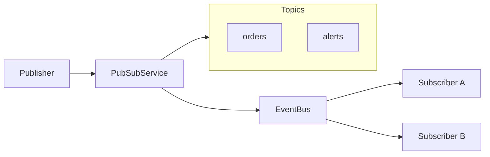
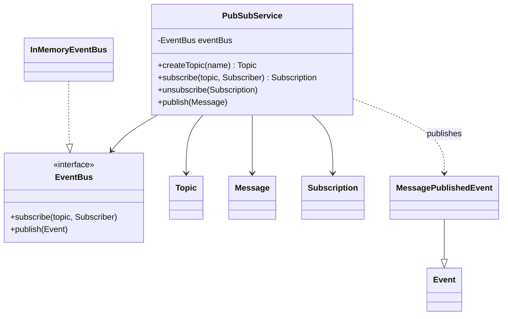
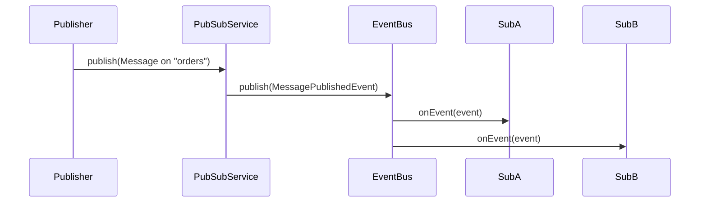

# Problem 21: Pub-Sub Messaging

## Problem Statement

Design a topic-based publish-subscribe messaging system where publishers send messages to named topics and subscribers receive only the events they subscribed to. The service wraps the shared `EventBus` and adds topic lifecycle and subscription management.

## Functional Requirements

1. Create named topics; reject duplicate topic names
2. Subscribe/unsubscribe to topics with opaque subscription handles
3. Publish messages to a topic; deliver to all active subscribers on that topic
4. List topics and subscription counts for observability

## Out of Scope

- Message persistence / replay
- Distributed brokers (Kafka, RabbitMQ)
- Dead-letter queues and retry policies

## Pub-Sub Architecture

## Class Diagram

## Sequence Diagram (Publish Flow)

## API Surface

| Method | Description |
|--------|-------------|
| `createTopic(String)` | Register a new topic |
| `subscribe(String, Subscriber)` | Attach listener; return `Subscription` |
| `unsubscribe(Subscription)` | Remove listener |
| `publish(Message)` | Fan-out to topic subscribers |
| `getTopics()` | List registered topic names |

## Design Patterns

- **Observer**: subscribers react to published events
- **Facade**: `PubSubService` wraps `EventBus` with topic/subscription bookkeeping
- **Shared infrastructure**: `com.lld.common.events.InMemoryEventBus`

## Concurrency Notes

`InMemoryEventBus` uses `ConcurrentHashMap` and `CopyOnWriteArrayList` for thread-safe subscribe/publish. Use `InMemoryEventBus(true)` for async delivery in production-style demos.

## Extension Questions

1. How would you add message filtering (e.g., tag-based subscriptions)?
2. How do you guarantee at-least-once delivery across process restarts?
3. When would you shard topics across multiple event buses?

## Package

`com.lld.problems.pubsub`

## Test Class

`PubSubTest`
