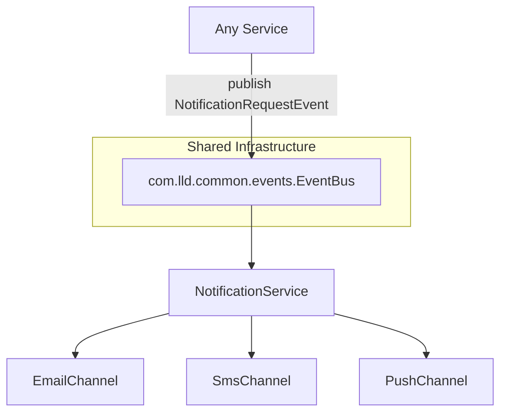
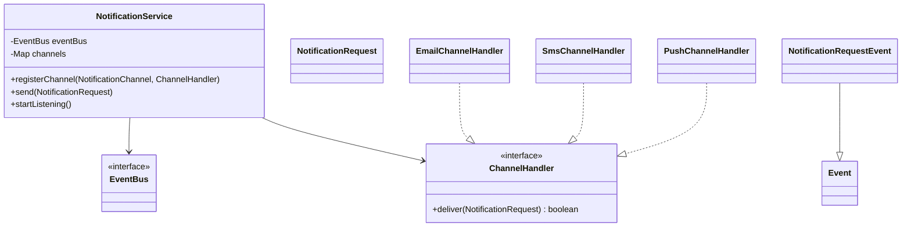
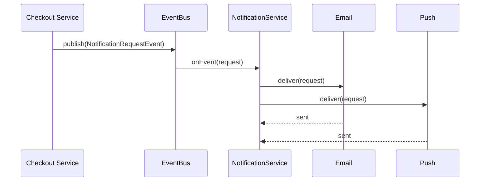

# Problem 22: Notification Service

## Problem Statement

Design a notification service that listens for notification requests on the shared `EventBus` and dispatches them to pluggable delivery channels (Email, SMS, Push). Producers publish a single event; channel-specific subscribers handle formatting and delivery.

## Functional Requirements

1. Accept notification requests via `EventBus` topic `notification.send`
2. Route to one or more channels: Email, SMS, Push
3. Track delivery outcomes per channel (sent / skipped)
4. Support channel-specific formatting without changing producers

## Out of Scope

- Real SMTP / Twilio / FCM integrations
- User preference management and quiet hours
- Template engines and localization

## Pub-Sub Architecture

> **Shared EventBus**: This problem uses the same `EventBus` / `InMemoryEventBus` from `com.lld.common.events` as [Problem 11 (Shopping Cart)](11-shopping-cart.md) and Problems 21, 23–25. Inject a single bus instance to wire checkout events to notifications.

## Class Diagram

## Sequence Diagram (Multi-Channel Dispatch)

## API Surface

| Method | Description |
|--------|-------------|
| `startListening()` | Subscribe to `notification.send` on EventBus |
| `send(NotificationRequest)` | Publish request event (producer API) |
| `registerChannel(...)` | Plug in Email/SMS/Push handlers |
| `getDeliveryLog()` | Inspect channel outcomes |

## Design Patterns

- **Strategy**: `ChannelHandler` per delivery channel
- **Observer**: `NotificationService` reacts to bus events
- **Shared EventBus**: decouples producers (checkout, alerts) from delivery

## Concurrency Notes

Channel handlers run synchronously on the publishing thread by default. For slow channels, wrap delivery in `InMemoryEventBus(async=true)` or offload inside each handler.

## Extension Questions

1. How would you add idempotency keys to prevent duplicate SMS?
2. How do you model per-user channel preferences on the same bus?
3. When should failed deliveries go to a dead-letter topic?

## Package

`com.lld.problems.notification`

## Test Class

`NotificationServiceTest`
