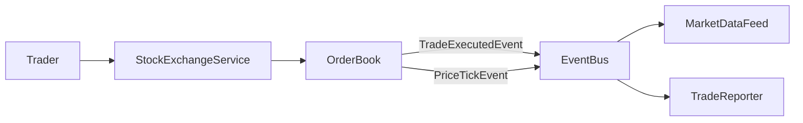
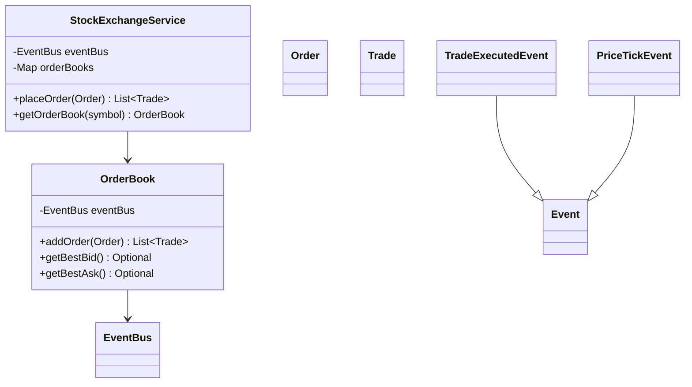
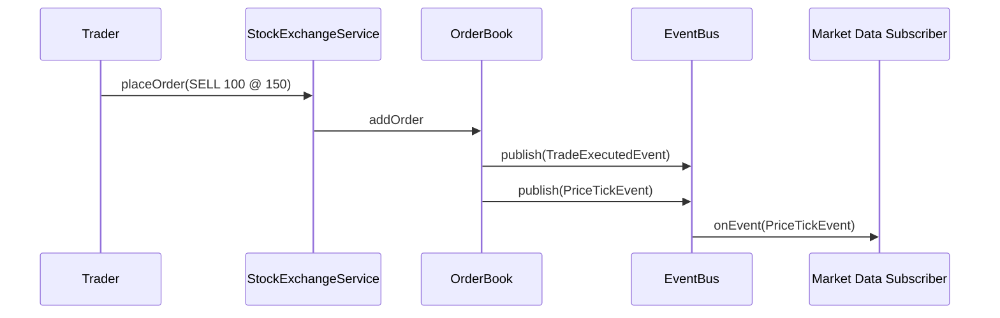

# Problem 23: Stock Exchange

## Problem Statement

Design a simplified stock exchange with per-symbol order books that match buy/sell orders and emit trade and price-tick events through the shared `EventBus`. Market data subscribers listen for ticks; trade reporters listen for executions.

## Functional Requirements

1. Place limit buy/sell orders on a symbol-specific `OrderBook`
2. Match orders by price-time priority; emit `TradeExecutedEvent`
3. Publish `PriceTickEvent` after each trade with last price and volume
4. Query best bid/ask and recent trades

## Out of Scope

- Market makers, circuit breakers, halts
- Partial fills across multiple price levels (beyond basic matching)
- Regulatory reporting and settlement

## Pub-Sub Architecture

## Class Diagram

## Sequence Diagram (Match + Tick)

## API Surface

| Method | Description |
|--------|-------------|
| `placeOrder(Order)` | Match and return trades |
| `getOrderBook(String symbol)` | Access book state |
| `getBestBid/Ask(String)` | Top of book |
| Topics: `trade.{symbol}`, `tick.{symbol}` | Event routing |

## Design Patterns

- **Observer**: market data via `EventBus`
- **Domain model**: `OrderBook` encapsulates matching logic
- **Event-driven**: decouple matching from downstream consumers

## Concurrency Notes

Order books are typically single-threaded per symbol. Use one `OrderBook` instance per symbol; external callers synchronize or route through an actor/queue per symbol.

## Extension Questions

1. How would you support stop-loss and market orders?
2. How do you broadcast level-2 depth snapshots?
3. What changes for after-hours vs regular session?

## Package

`com.lld.problems.stockexchange`

## Test Class

`StockExchangeTest`
