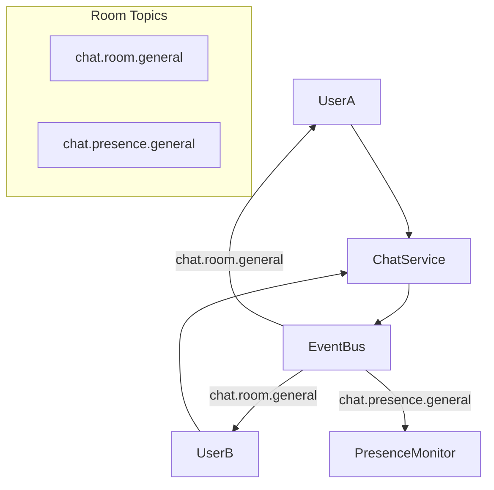
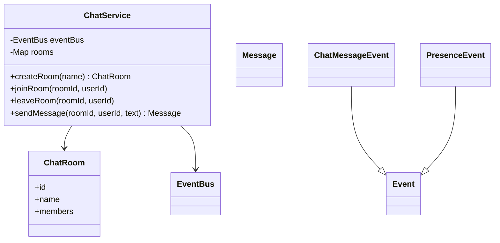
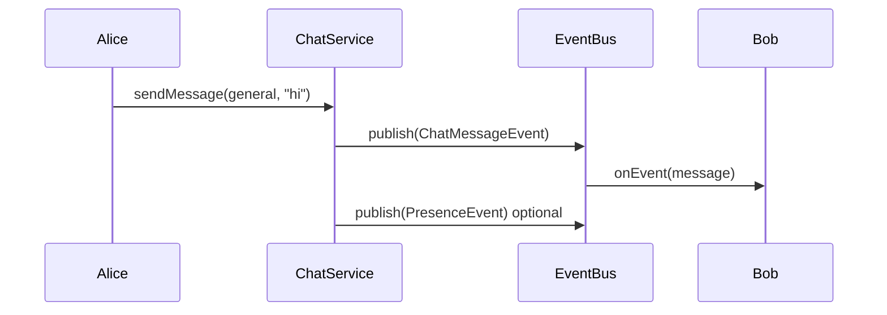

# Problem 24: Chat Application

## Problem Statement

Design a room-based chat system where users join chat rooms, send messages, and receive presence updates. Each room maps to an `EventBus` topic for broadcast; presence changes use a dedicated topic per room.

## Functional Requirements

1. Create/join/leave `ChatRoom` instances
2. Broadcast chat messages to all members in a room via room topic
3. Publish presence events (join, leave, online) on `chat.presence.{roomId}`
4. Retrieve message history for a room (in-memory)

## Out of Scope

- WebSocket transport and mobile push
- End-to-end encryption
- Message persistence across restarts

## Pub-Sub Architecture

## Class Diagram

## Sequence Diagram (Room Broadcast)

## API Surface

| Method | Description |
|--------|-------------|
| `createRoom(String)` | New room with unique id |
| `joinRoom / leaveRoom` | Membership + presence events |
| `sendMessage(roomId, userId, text)` | Broadcast to room topic |
| `getHistory(roomId)` | In-memory log |
| Topics: `chat.room.{id}`, `chat.presence.{id}` | Per-room channels |

## Design Patterns

- **Observer**: members subscribe to room topics
- **Channel-based routing**: topic per room isolates traffic
- **Shared EventBus**: same infrastructure as Problems 21–22, 25

## Concurrency Notes

`CopyOnWriteArrayList` backs member lists; message history uses synchronized append. For high fan-out rooms, consider async bus delivery.

## Extension Questions

1. How would you add direct messages (1:1) without room pollution?
2. How do you implement typing indicators on the same bus?
3. When should you shard rooms across multiple buses?

## Package

`com.lld.problems.chat`

## Test Class

`ChatTest`
