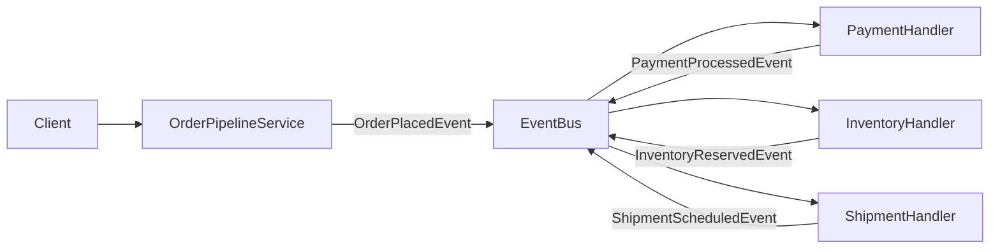
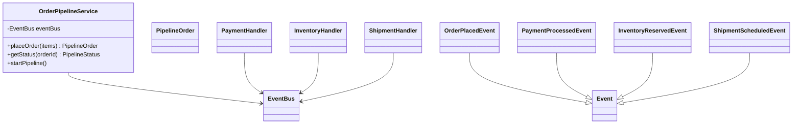
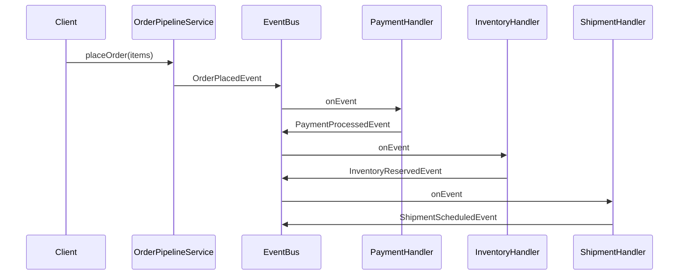

# Problem 25: Event-Driven Order Pipeline

## Problem Statement

Design a saga-style order fulfillment pipeline where each stage reacts to bus events and publishes the next stage's event. `OrderPipelineService` kicks off the flow; payment, inventory, and shipment handlers coordinate through the shared `EventBus` without tight coupling.

## Functional Requirements

1. `placeOrder` publishes `OrderPlacedEvent` and returns order id
2. Payment handler listens on `order.placed`, publishes `PaymentProcessedEvent`
3. Inventory handler listens on `order.payment`, publishes `InventoryReservedEvent`
4. Shipment handler listens on `order.inventory`, publishes `ShipmentScheduledEvent`
5. Expose pipeline status per order

## Out of Scope

- Distributed transactions / 2PC
- Compensation / rollback sagas (extension only)
- External payment gateways and WMS APIs

## Pub-Sub Architecture

## Class Diagram

## Sequence Diagram (Saga Chain)

## API Surface

| Method | Description |
|--------|-------------|
| `placeOrder(List<String> items)` | Start saga |
| `startPipeline()` | Wire stage handlers to topics |
| `getStatus(orderId)` | Current pipeline stage |
| Topics: `order.placed`, `order.payment`, `order.inventory`, `order.shipment` | Saga topics |

## Design Patterns

- **Saga / choreography**: stages coordinated via events
- **Observer**: each handler subscribes to its trigger topic
- **EventBus**: shared choreographer across handlers

## Concurrency Notes

Handlers run synchronously in scaffold tests. In production, use idempotent handlers and outbox pattern; async bus isolates slow I/O.

## Extension Questions

1. How would you add compensating transactions on payment failure?
2. Where do you persist saga state for crash recovery?
3. How do you detect and fix stuck pipelines?

## Package

`com.lld.problems.orderpipeline`

## Test Class

`OrderPipelineTest`
