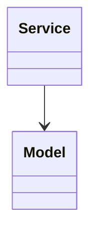
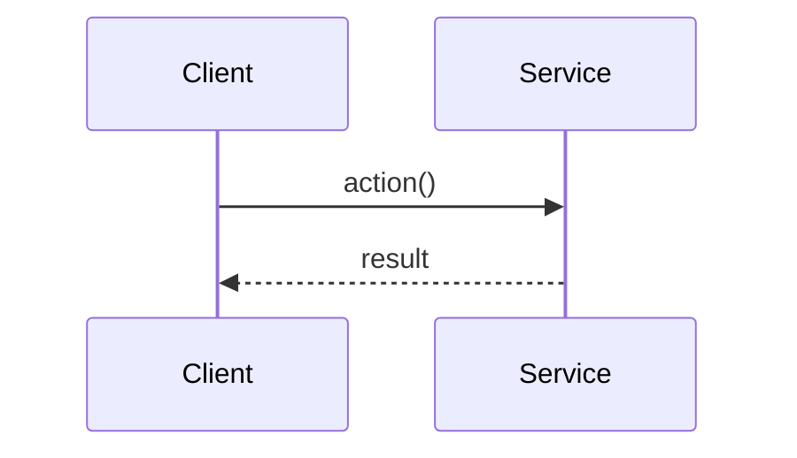

# Problem NN: Title

## Problem Statement

<!-- 2-3 sentences describing the system -->

## Functional Requirements

1.
2.
3.

## Out of Scope

- Database / persistence
- REST APIs / Spring Boot
- Distributed deployment

## Class Diagram

## Sequence Diagram (Key Flow)

## API Surface

| Method | Description |
|--------|-------------|
| | |

## Design Patterns

- **Pattern**: where used

## Concurrency Notes

<!-- For Tier 3/4 only: locks, queues, thread safety boundaries -->

## Extension Questions

1.
2.
3.

## Package

`com.lld.problems.<slug>`

## Test Class

`<ProblemName>Test` in `src/test/java/com/lld/problems/<slug>/`
